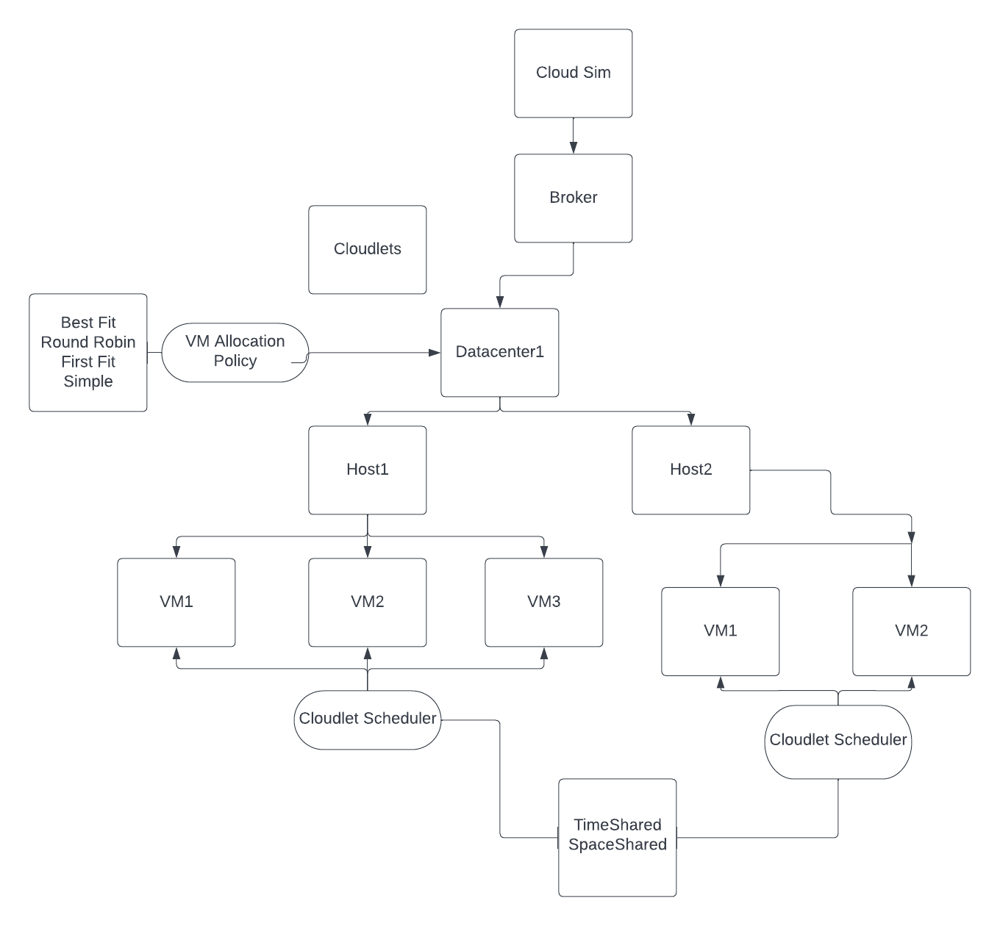
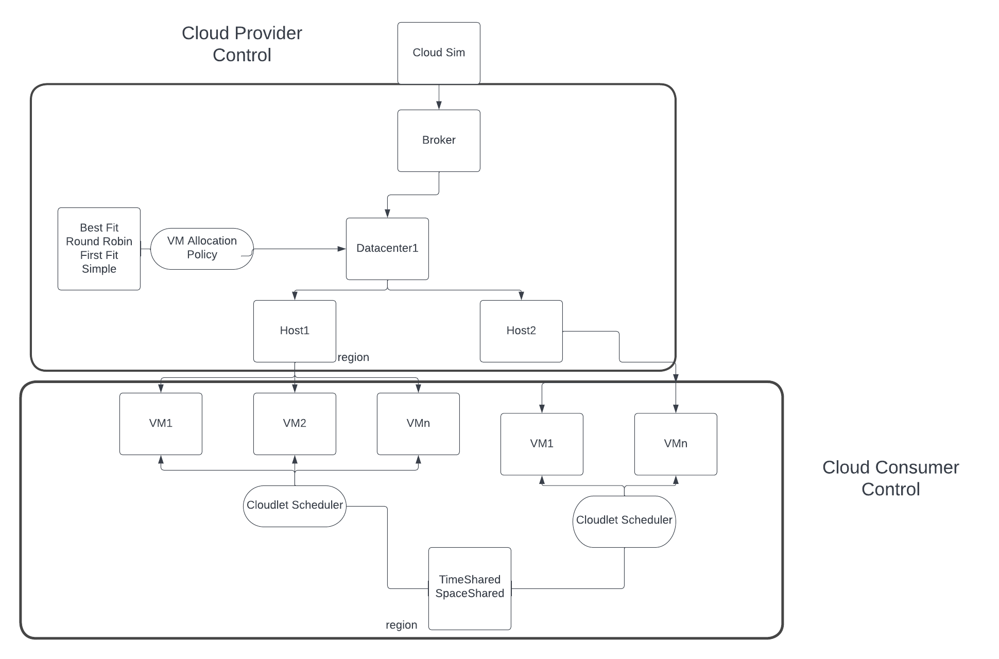
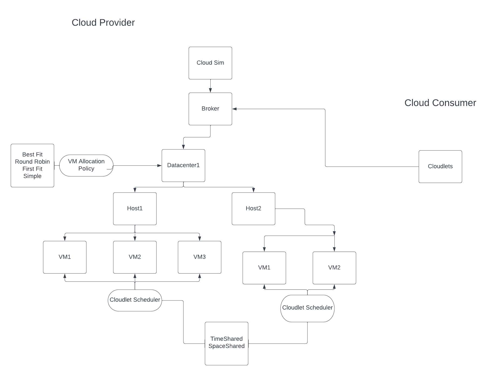
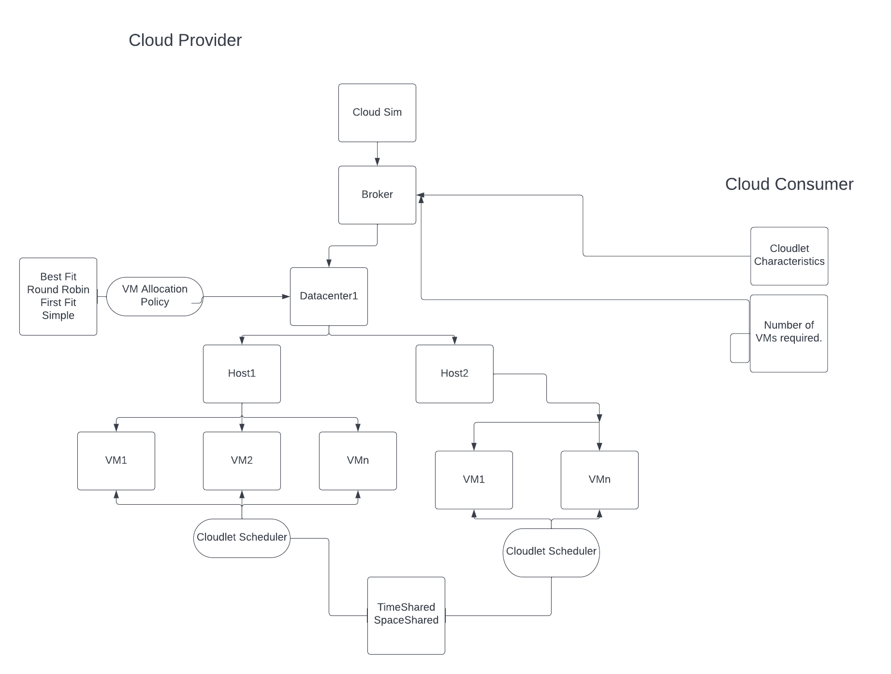
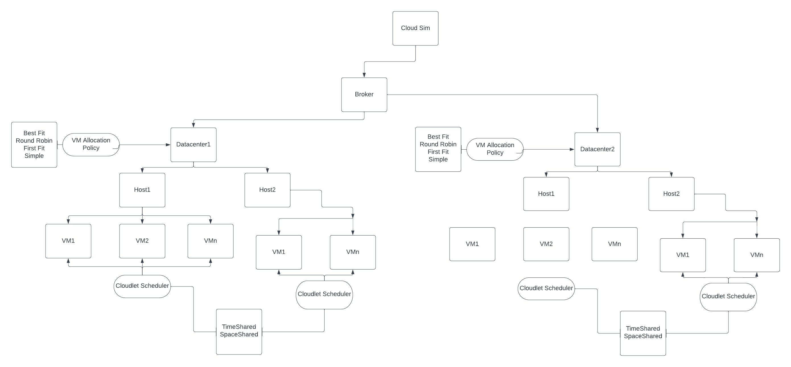

<h1>Homework 3 - Cloud Organization Simulation</h1>

<h2>Submission by: Sasanka Mouli Subrahmanya Sri Veleti</h2>

<h2>Objective of the Project:</h2>
<p style="font-size: 20px">To Create Cloud Simulators for evaluating executions of applications in cloud datacenters with different characteristics and deployment models.</p>

<h3>Environment and Dependencies used to set up this project</h3>
<ul>
    <li>Operating System: Windows 11 Enterprise, Version - 21H2</li>
    <li>IDE: IntelliJ IDEA Ultimate 2022.2.2</li>
    <li>Java Version - 19.0.1</li>
    <li>Scala Version- 3.1.3, sbt - Version 1.6.2 </li>
    <li>cloudsimplus- 7.3.0</li>
</ul>

Note: This project runs only on top of Java 17+ so make sure you have appropriate JAVA SDK installed.

<h3>Project Structure:</h3>
<p>The project here consists of primarily 5 Simulations namely IaasSimulation, SaasSimulation, PaasSimulation, CombinedSimulation(which uses all Iaas, Saas, Paas datacenters) and another MainSimulation which outputs all the statistics pertaining to a cloud infrastructure.</p>

<h3>Steps to follow to make this project run:</h3>
<ol>
<li>Clone this repository.</li>

```
git clone https://github.com/sasankamouliveleti/Homework3_CloudSim.git
```

<li>Change the required configurations of hosts, cloudlets, and vms in the resources folder for the corresponding simulation</li>
<li>Compile the project using the following command</li>

```
sbt clean compile
```

<li>Run the tests using following command</li>

```
sbt test
```

<li>Run the project using following command</li>

```
sbt run
```

as there are multiple main classes you will be prompted with the class to choose. The description of classes is below
<ol>
<li>Simulation1 - Results out power consumed, cpu utilization metrics and summary of simulation results using default VM Allocation Policy</li>
<li>Simulation2 - Results out the cost of the operation and summary of simulation results using default VM Allocation Policy</li>
<li>Simulation3 - Results out the RAM, CPU usage and different other metrics of VMs</li>
<li>MainSimulation - This is Simulation is culmination of above three simulations</li>
<li>IaasSimulation - This is a simulation of Iaas datacenter, its behavior while allocating resources and handling cloudlets</li>
<li>SaasSimulation - This is a simulation of Saas datacenter, its behavior while allocating resources and handling cloudlets</li>
<li>PaasSimulation - This is a simulation of Paas datacenter, its behavior while allocating resources and handling cloudlets</li>
<li>CombinedSimulation - This is a simulation of ring network topology with a single broker of Iaas, Saas, Paas datacenters.</li>
</ol>
</ol>

Now, let us explore each Simulation along with its architecture diagram and results. I am leaving out the Simulations 1,2,3 because the MainSimulation is culmination of said 3.

<h3>Disucssion on Various Simulations Architecture and Results</h3>
<h3>MainSimulation</h3>
<p>The MainSimulation has one datacenter with hosts, vms and cloudlets created based on parameters in mainsimulation.conf. Here we make use of horizontal scalable vms and analyse the CPU utilization, power utilization during the simulation.</p>
<p>The Architecture diagram is below:</p>

<p>Now let us compare the performance with different scheduling policies.</p>
<ol>
<li><h4>Vm Allocation Policy - Simple, Cloudlet Scheduling - TimeShared.</h4></li>
<p>Results:</p>

```
================== Simulation finished at time 135.62 ==================


                                                              SIMULATION RESULTS

|Cloudlet|Status |DC|Host|Host PEs |VM|VM PEs   |CloudletLen|FinishedLen|CloudletPEs|StartTime|FinishTime|ExecTime|CPU Usage|RAM Usage|Bandwidth
|--------|-------|--|----|---------|--|---------|-----------|-----------|-----------|---------|----------|--------|---------|---------|---------
|      ID|       |ID|  ID|CPU cores|ID|CPU cores|         MI|         MI|  CPU cores|  Seconds|   Seconds| Seconds|  seconds|       Mb|       Mb
|       0|SUCCESS| 1|   2|        5| 0|        3|      10000|      10000|          2|      105|       118|      13|    13.44|     0.20|     0.20
|       5|SUCCESS| 1|   2|        5| 0|        3|      10000|      10000|          2|      105|       118|      13|    13.44|     0.20|     0.20
|       1|SUCCESS| 1|   2|        5| 1|        2|      10000|      10000|          2|      105|       125|      20|    20.11|     0.20|     0.20
|       6|SUCCESS| 1|   2|        5| 1|        2|      10000|      10000|          2|      105|       125|      20|    20.11|     0.20|     0.20
|       2|SUCCESS| 1|   4|        5| 2|        2|      10000|      10000|          1|      105|       120|      15|    15.11|     0.20|     0.20
|       7|SUCCESS| 1|   4|        5| 2|        2|      10000|      10000|          2|      105|       120|      15|    15.11|     0.20|     0.20
|       3|SUCCESS| 1|   4|        5| 3|        3|      10000|      10000|          2|      105|       115|      10|    10.00|     0.20|     0.20
|       8|SUCCESS| 1|   4|        5| 3|        3|      10000|      10000|          1|      105|       115|      10|    10.00|     0.20|     0.20
|       4|SUCCESS| 1|   5|        5| 4|        3|      10000|      10000|          2|      105|       118|      13|    13.44|     0.20|     0.20
|       9|SUCCESS| 1|   5|        5| 4|        3|      10000|      10000|          2|      105|       118|      13|    13.44|     0.20|     0.20
15:14:36.231 [main] INFO  MainSimulation - 5
15:14:36.231 [main] INFO  MainSimulation - VM ID | CPU Mean Usage | Power Consumption Mean
15:14:36.233 [main] INFO  MainSimulation - 0|40.0|21.0
15:14:36.233 [main] INFO  MainSimulation - 1|93.0|25.0
15:14:36.233 [main] INFO  MainSimulation - 2|59.0|22.0
15:14:36.233 [main] INFO  MainSimulation - 3|25.0|20.0
15:14:36.233 [main] INFO  MainSimulation - 4|40.0|41.0
15:14:36.235 [main] INFO  MainSimulation - The finished vms size is 5
15:14:36.239 [main] INFO  MainSimulation - The total cost is 2.884246666666668
15:14:36.239 [main] INFO  MainSimulation - **************Exiting MainSimulation********************

```
<li><h4>Vm Allocation Policy - Round Robin, Cloudlet Scheduling - TimeShared.</h4></li>
<p>Results:</p>

```
================== Simulation finished at time 110.52 ==================


                                                              SIMULATION RESULTS

|Cloudlet|Status |DC|Host|Host PEs |VM|VM PEs   |CloudletLen|FinishedLen|CloudletPEs|StartTime|FinishTime|ExecTime|CPU Usage|RAM Usage|Bandwidth
|--------|-------|--|----|---------|--|---------|-----------|-----------|-----------|---------|----------|--------|---------|---------|---------
|      ID|       |ID|  ID|CPU cores|ID|CPU cores|         MI|         MI|  CPU cores|  Seconds|   Seconds| Seconds|  seconds|       Mb|       Mb
|       4|SUCCESS| 1|   4|        4| 0|        2|      10000|      10000|          2|       80|       100|      20|    20.11|     0.20|     0.20
|       9|SUCCESS| 1|   4|        4| 0|        2|      10000|      10000|          2|       80|       100|      20|    20.11|     0.20|     0.20
|       0|SUCCESS| 1|   0|        4| 1|        3|      10000|      10000|          1|       80|        90|      10|    10.11|     0.20|     0.20
|       5|SUCCESS| 1|   0|        4| 1|        3|      10000|      10000|          1|       80|        90|      10|    10.11|     0.20|     0.20
|       1|SUCCESS| 1|   1|        5| 2|        3|      10000|      10000|          1|       80|        90|      10|    10.11|     0.20|     0.20
|       6|SUCCESS| 1|   1|        5| 2|        3|      10000|      10000|          1|       80|        90|      10|    10.11|     0.20|     0.20
|       2|SUCCESS| 1|   2|        5| 3|        3|      10000|      10000|          2|       80|        93|      13|    13.44|     0.20|     0.20
|       7|SUCCESS| 1|   2|        5| 3|        3|      10000|      10000|          2|       80|        93|      13|    13.44|     0.20|     0.20
|       3|SUCCESS| 1|   3|        5| 4|        2|      10000|      10000|          1|       80|        90|      10|    10.11|     0.20|     0.20
|       8|SUCCESS| 1|   3|        5| 4|        2|      10000|      10000|          1|       80|        90|      10|    10.11|     0.20|     0.20
15:19:22.638 [main] INFO  MainSimulation - 5
15:19:22.638 [main] INFO  MainSimulation - VM ID | CPU Mean Usage | Power Consumption Mean
15:19:22.639 [main] INFO  MainSimulation - 0|93.0|49.0
15:19:22.640 [main] INFO  MainSimulation - 1|17.0|38.0
15:19:22.640 [main] INFO  MainSimulation - 2|17.0|38.0
15:19:22.640 [main] INFO  MainSimulation - 3|44.0|42.0
15:19:22.640 [main] INFO  MainSimulation - 4|25.0|39.0
15:19:22.642 [main] INFO  MainSimulation - The finished vms size is 5
15:19:22.646 [main] INFO  MainSimulation - The total cost is 2.5553333333333335
15:19:22.646 [main] INFO  MainSimulation - **************Exiting MainSimulation********************
```

<li><h4>Vm Allocation Policy - Best Fit, Cloudlet Scheduling - TimeShared.</h4></li>
<p>Results:</p>

```
================== Simulation finished at time 130.62 ==================


                                                              SIMULATION RESULTS

|Cloudlet|Status |DC|Host|Host PEs |VM|VM PEs   |CloudletLen|FinishedLen|CloudletPEs|StartTime|FinishTime|ExecTime|CPU Usage|RAM Usage|Bandwidth
|--------|-------|--|----|---------|--|---------|-----------|-----------|-----------|---------|----------|--------|---------|---------|---------
|      ID|       |ID|  ID|CPU cores|ID|CPU cores|         MI|         MI|  CPU cores|  Seconds|   Seconds| Seconds|  seconds|       Mb|       Mb
|       0|SUCCESS| 1|   1|        4| 0|        3|      10000|      10000|          2|      105|       115|      10|    10.00|     0.20|     0.20
|       5|SUCCESS| 1|   1|        4| 0|        3|      10000|      10000|          1|      105|       115|      10|    10.00|     0.20|     0.20
|       1|SUCCESS| 1|   1|        4| 1|        2|      10000|      10000|          2|      105|       120|      15|    15.11|     0.20|     0.20
|       6|SUCCESS| 1|   1|        4| 1|        2|      10000|      10000|          1|      105|       120|      15|    15.11|     0.20|     0.20
|       2|SUCCESS| 1|   2|        4| 2|        3|      10000|      10000|          2|      105|       115|      10|    10.00|     0.20|     0.20
|       7|SUCCESS| 1|   2|        4| 2|        3|      10000|      10000|          1|      105|       115|      10|    10.00|     0.20|     0.20
|       4|SUCCESS| 1|   3|        4| 3|        3|      10000|      10000|          2|      105|       115|      10|    10.00|     0.20|     0.20
|       9|SUCCESS| 1|   3|        4| 3|        3|      10000|      10000|          1|      105|       115|      10|    10.00|     0.20|     0.20
|       3|SUCCESS| 1|   2|        4| 4|        2|      10000|      10000|          1|      105|       115|      10|    10.00|     0.20|     0.20
|       8|SUCCESS| 1|   2|        4| 4|        2|      10000|      10000|          1|      105|       115|      10|    10.00|     0.20|     0.20
15:20:57.965 [main] INFO  MainSimulation - 5
15:20:57.965 [main] INFO  MainSimulation - VM ID | CPU Mean Usage | Power Consumption Mean
15:20:57.967 [main] INFO  MainSimulation - 0|47.0|21.0
15:20:57.968 [main] INFO  MainSimulation - 1|91.0|25.0
15:20:57.968 [main] INFO  MainSimulation - 2|47.0|21.0
15:20:57.968 [main] INFO  MainSimulation - 3|47.0|42.0
15:20:57.968 [main] INFO  MainSimulation - 4|47.0|21.0
15:20:57.971 [main] INFO  MainSimulation - The finished vms size is 5
15:20:57.974 [main] INFO  MainSimulation - The total cost is 2.2044000000000032
15:20:57.974 [main] INFO  MainSimulation - **************Exiting MainSimulation********************
```

<li><h4>Vm Allocation Policy - Round Robin, Cloudlet Scheduling - Space Shared.</h4></li>
<p>Results:</p>

```
================== Simulation finished at time 110.74 ==================


                                                              SIMULATION RESULTS

|Cloudlet|Status |DC|Host|Host PEs |VM|VM PEs   |CloudletLen|FinishedLen|CloudletPEs|StartTime|FinishTime|ExecTime|CPU Usage|RAM Usage|Bandwidth
|--------|-------|--|----|---------|--|---------|-----------|-----------|-----------|---------|----------|--------|---------|---------|---------
|      ID|       |ID|  ID|CPU cores|ID|CPU cores|         MI|         MI|  CPU cores|  Seconds|   Seconds| Seconds|  seconds|       Mb|       Mb
|       4|SUCCESS| 1|   4|        5| 0|        3|      10000|      10000|          2|       80|        90|      10|    10.11|     0.20|     0.20
|       9|SUCCESS| 1|   4|        5| 0|        3|      10000|      10000|          1|       80|        90|      10|    10.11|     0.20|     0.20
|       0|SUCCESS| 1|   0|        4| 1|        3|      10000|      10000|          1|       80|        90|      10|    10.11|     0.20|     0.20
|       5|SUCCESS| 1|   0|        4| 1|        3|      10000|      10000|          1|       80|        90|      10|    10.11|     0.20|     0.20
|       1|SUCCESS| 1|   1|        4| 2|        3|      10000|      10000|          2|       80|        90|      10|    10.11|     0.20|     0.20
|       6|SUCCESS| 1|   1|        4| 2|        3|      10000|      10000|          2|       91|       100|      10|    10.11|     0.20|     0.20
|       2|SUCCESS| 1|   2|        4| 3|        2|      10000|      10000|          1|       80|        90|      10|    10.11|     0.20|     0.20
|       7|SUCCESS| 1|   2|        4| 3|        2|      10000|      10000|          1|       80|        90|      10|    10.11|     0.20|     0.20
|       3|SUCCESS| 1|   3|        5| 4|        2|      10000|      10000|          1|       80|        90|      10|    10.11|     0.20|     0.20
|       8|SUCCESS| 1|   3|        5| 4|        2|      10000|      10000|          2|       91|       100|      10|    10.11|     0.20|     0.20
15:22:54.746 [main] INFO  MainSimulation - 5
15:22:54.746 [main] INFO  MainSimulation - VM ID | CPU Mean Usage | Power Consumption Mean
15:22:54.748 [main] INFO  MainSimulation - 0|36.0|41.0
15:22:54.748 [main] INFO  MainSimulation - 1|24.0|39.0
15:22:54.748 [main] INFO  MainSimulation - 2|61.0|45.0
15:22:54.748 [main] INFO  MainSimulation - 3|36.0|41.0
15:22:54.748 [main] INFO  MainSimulation - 4|69.0|46.0
15:22:54.750 [main] INFO  MainSimulation - The finished vms size is 5
15:22:54.754 [main] INFO  MainSimulation - The total cost is 2.022
15:22:54.754 [main] INFO  MainSimulation - **************Exiting MainSimulation********************
```

<li><h4>Vm Allocation Policy - Best Fit, Cloudlet Scheduling - Space Shared.</h4></li>
<p>Results:</p>

```
================== Simulation finished at time 186.04 ==================


                                                              SIMULATION RESULTS

|Cloudlet|Status |DC|Host|Host PEs |VM|VM PEs   |CloudletLen|FinishedLen|CloudletPEs|StartTime|FinishTime|ExecTime|CPU Usage|RAM Usage|Bandwidth
|--------|-------|--|----|---------|--|---------|-----------|-----------|-----------|---------|----------|--------|---------|---------|---------
|      ID|       |ID|  ID|CPU cores|ID|CPU cores|         MI|         MI|  CPU cores|  Seconds|   Seconds| Seconds|  seconds|       Mb|       Mb
|       0|SUCCESS| 1|   0|        4| 0|        2|      10000|      10000|          1|      156|       165|      10|    10.11|     0.20|     0.20
|       5|SUCCESS| 1|   0|        4| 0|        2|      10000|      10000|          1|      156|       165|      10|    10.11|     0.20|     0.20
|       1|SUCCESS| 1|   1|        4| 1|        3|      10000|      10000|          1|      156|       165|      10|    10.11|     0.20|     0.20
|       6|SUCCESS| 1|   1|        4| 1|        3|      10000|      10000|          2|      156|       165|      10|    10.11|     0.20|     0.20
|       2|SUCCESS| 1|   2|        4| 2|        3|      10000|      10000|          2|      156|       165|      10|    10.11|     0.20|     0.20
|       7|SUCCESS| 1|   2|        4| 2|        3|      10000|      10000|          2|      166|       175|      10|    10.11|     0.20|     0.20
|       3|SUCCESS| 1|   3|        4| 3|        3|      10000|      10000|          2|      156|       165|      10|    10.11|     0.20|     0.20
|       8|SUCCESS| 1|   3|        4| 3|        3|      10000|      10000|          2|      166|       175|      10|    10.11|     0.20|     0.20
|       4|SUCCESS| 1|   4|        4| 4|        3|      10000|      10000|          2|      156|       165|      10|    10.11|     0.20|     0.20
|       9|SUCCESS| 1|   4|        4| 4|        3|      10000|      10000|          1|      156|       165|      10|    10.11|     0.20|     0.20
15:23:45.164 [main] INFO  MainSimulation - 5
15:23:45.164 [main] INFO  MainSimulation - VM ID | CPU Mean Usage | Power Consumption Mean
15:23:45.166 [main] INFO  MainSimulation - 0|38.0|41.0
15:23:45.166 [main] INFO  MainSimulation - 1|38.0|41.0
15:23:45.166 [main] INFO  MainSimulation - 2|62.0|45.0
15:23:45.166 [main] INFO  MainSimulation - 3|62.0|45.0
15:23:45.166 [main] INFO  MainSimulation - 4|38.0|41.0
15:23:45.168 [main] INFO  MainSimulation - The finished vms size is 5
15:23:45.172 [main] INFO  MainSimulation - The total cost is 2.022000000000002
15:23:45.172 [main] INFO  MainSimulation - **************Exiting MainSimulation********************
```
</ol>

<p>From the above simulations we can infer that using Round Robin vm allocation policy along with Space Shared cloudlet scheduling costs less.</p>

<h3>IaasSimulation</h3>
<p>From the definition of Infrastructure as a Service we know that the cloud provider has control over the hardware and the cloud consumer has control over the virtual machines available and cloudlets</p>


<p>A simulation is ran based on the parameters from iaas.conf is ran and the results are below</p>

```
================== Simulation finished at time 20.44 ==================


                                               SIMULATION RESULTS

|Cloudlet|Status |DC|Host|Host PEs |VM|VM PEs   |CloudletLen|FinishedLen|CloudletPEs|StartTime|FinishTime|ExecTime
|--------|-------|--|----|---------|--|---------|-----------|-----------|-----------|---------|----------|--------
|      ID|       |ID|  ID|CPU cores|ID|CPU cores|         MI|         MI|  CPU cores|  Seconds|   Seconds| Seconds
|       0|SUCCESS| 1|   0|        5| 0|        3|      10000|      10000|          2|        0|        10|      10
|       5|SUCCESS| 1|   0|        5| 0|        3|      10000|      10000|          1|        0|        10|      10
|       1|SUCCESS| 1|   1|        5| 1|        3|      10000|      10000|          2|        0|        10|      10
|       6|SUCCESS| 1|   1|        5| 1|        3|      10000|      10000|          2|       10|        20|      10
|       2|SUCCESS| 1|   2|        5| 2|        2|      10000|      10000|          1|        0|        10|      10
|       7|SUCCESS| 1|   2|        5| 2|        2|      10000|      10000|          1|        0|        10|      10
|       3|SUCCESS| 1|   3|        5| 3|        3|      10000|      10000|          2|        0|        10|      10
|       8|SUCCESS| 1|   3|        5| 3|        3|      10000|      10000|          2|       10|        20|      10
|       4|SUCCESS| 1|   4|        5| 4|        3|      10000|      10000|          1|        0|        10|      10
|       9|SUCCESS| 1|   4|        5| 4|        3|      10000|      10000|          1|        0|        10|      10
15:51:13.125 [main] INFO  ModelSimulations.IaasSimulation - **************Exiting IaasSimulation********************
```

<h3>SaasSimulation</h3>
<p>From the definition of Software as a Service we know that the cloud provider has control over VMs, Hosts, Datacenter characteristics and cloulet characteristics and the consumer can only specify number of cloudlets required for execution.</p>


<p>A simulation is ran based on the parameters from saas.conf is ran and the results are below</p>

```
================== Simulation finished at time 35.32 ==================


                                               SIMULATION RESULTS

|Cloudlet|Status |DC|Host|Host PEs |VM|VM PEs   |CloudletLen|FinishedLen|CloudletPEs|StartTime|FinishTime|ExecTime
|--------|-------|--|----|---------|--|---------|-----------|-----------|-----------|---------|----------|--------
|      ID|       |ID|  ID|CPU cores|ID|CPU cores|         MI|         MI|  CPU cores|  Seconds|   Seconds| Seconds
|       0|SUCCESS| 1|   0|        4| 0|        3|      10000|      10000|          1|        0|        10|      10
|       5|SUCCESS| 1|   0|        4| 0|        3|      10000|      10000|          2|        0|        10|      10
|      10|SUCCESS| 1|   0|        4| 0|        3|      10000|      10000|          1|       10|        20|      10
|      15|SUCCESS| 1|   0|        4| 0|        3|      10000|      10000|          1|       10|        20|      10
|      20|SUCCESS| 1|   0|        4| 0|        3|      10000|      10000|          2|       20|        30|      10
|       1|SUCCESS| 1|   0|        4| 1|        2|      10000|      10000|          2|        0|        35|      35
|       6|SUCCESS| 1|   0|        4| 1|        2|      10000|      10000|          1|        0|        35|      35
|      11|SUCCESS| 1|   0|        4| 1|        2|      10000|      10000|          2|        0|        35|      35
|      16|SUCCESS| 1|   0|        4| 1|        2|      10000|      10000|          1|        0|        35|      35
|      21|SUCCESS| 1|   0|        4| 1|        2|      10000|      10000|          1|        0|        35|      35
|       2|SUCCESS| 1|   1|        4| 2|        2|      10000|      10000|          2|        0|        30|      30
|       7|SUCCESS| 1|   1|        4| 2|        2|      10000|      10000|          1|        0|        30|      30
|      12|SUCCESS| 1|   1|        4| 2|        2|      10000|      10000|          1|        0|        30|      30
|      17|SUCCESS| 1|   1|        4| 2|        2|      10000|      10000|          2|        0|        30|      30
|       3|SUCCESS| 1|   1|        4| 3|        3|      10000|      10000|          2|        0|        10|      10
|      18|SUCCESS| 1|   1|        4| 3|        3|      10000|      10000|          1|        0|        10|      10
|       8|SUCCESS| 1|   1|        4| 3|        3|      10000|      10000|          2|       10|        20|      10
|      13|SUCCESS| 1|   1|        4| 3|        3|      10000|      10000|          2|       20|        30|      10
|       4|SUCCESS| 1|   2|        4| 4|        3|      10000|      10000|          1|        0|        10|      10
|       9|SUCCESS| 1|   2|        4| 4|        3|      10000|      10000|          1|        0|        10|      10
|      19|SUCCESS| 1|   2|        4| 4|        3|      10000|      10000|          1|        0|        10|      10
|      14|SUCCESS| 1|   2|        4| 4|        3|      10000|      10000|          2|       10|        20|      10
16:04:00.257 [main] INFO  ModelSimulations.SaasSimulation - **************Exiting SaasSimulation********************
```

<h3>PaasSimulation</h3>
<p>From the definition of Platform as a Service we know that the cloud provider has control over Vms, hosts and datacenter charateristics and the consumer has control on cloudlet characteristics and number of vms required to execute the cloudlets.</p>


<p>A simulation is ran based on the parameters from paas.conf is ran and the results are below</p>

```
================== Simulation finished at time 20.44 ==================


                                               SIMULATION RESULTS

|Cloudlet|Status |DC|Host|Host PEs |VM|VM PEs   |CloudletLen|FinishedLen|CloudletPEs|StartTime|FinishTime|ExecTime
|--------|-------|--|----|---------|--|---------|-----------|-----------|-----------|---------|----------|--------
|      ID|       |ID|  ID|CPU cores|ID|CPU cores|         MI|         MI|  CPU cores|  Seconds|   Seconds| Seconds
|       0|SUCCESS| 1|   0|        5| 0|        3|      10000|      10000|          2|        0|        10|      10
|       5|SUCCESS| 1|   0|        5| 0|        3|      10000|      10000|          2|       10|        20|      10
|       1|SUCCESS| 1|   1|        4| 1|        2|      10000|      10000|          2|        0|        15|      15
|       6|SUCCESS| 1|   1|        4| 1|        2|      10000|      10000|          1|        0|        15|      15
|       2|SUCCESS| 1|   2|        5| 2|        3|      10000|      10000|          2|        0|        10|      10
|       7|SUCCESS| 1|   2|        5| 2|        3|      10000|      10000|          2|       10|        20|      10
|       3|SUCCESS| 1|   3|        5| 3|        2|      10000|      10000|          1|        0|        15|      15
|       8|SUCCESS| 1|   3|        5| 3|        2|      10000|      10000|          2|        0|        15|      15
|       4|SUCCESS| 1|   4|        5| 4|        3|      10000|      10000|          1|        0|        10|      10
|       9|SUCCESS| 1|   4|        5| 4|        3|      10000|      10000|          1|        0|        10|      10
16:06:25.369 [main] INFO  ModelSimulations.PaasSimulation - **************Exiting PaasSimulation********************
```

<h3>Combined Simulation with 3 Datacenters(Iaas, Saas, Paas)</h3>
<p>A Ring topology is formed with a single broker and 3 datacenters Iaas, Saas, Paas</p>


<p>A simulation is ran based on the parameters from combinedsimulation.conf is ran and the results are below</p>

```
================== Simulation finished at time 90.86 ==================


                                               SIMULATION RESULTS

|Cloudlet|Status |DC|Host|Host PEs |VM|VM PEs   |CloudletLen|FinishedLen|CloudletPEs|StartTime|FinishTime|ExecTime
|--------|-------|--|----|---------|--|---------|-----------|-----------|-----------|---------|----------|--------
|      ID|       |ID|  ID|CPU cores|ID|CPU cores|         MI|         MI|  CPU cores|  Seconds|   Seconds| Seconds
|       0|SUCCESS| 1|   0|        5| 0|        3|      10000|      10000|          2|       50|        60|      10
|       5|SUCCESS| 1|   0|        5| 0|        3|      10000|      10000|          1|       50|        60|      10
|       0|SUCCESS| 1|   1|        4| 0|        3|      10000|      10000|          2|       50|        60|      10
|       5|SUCCESS| 1|   1|        4| 0|        3|      10000|      10000|          1|       50|        60|      10
|       0|SUCCESS| 1|   2|        5| 0|        3|      10000|      10000|          2|       50|        60|      10
|      10|SUCCESS| 1|   0|        5| 0|        3|      10000|      10000|          2|       60|        70|      10
|      11|SUCCESS| 1|   1|        4| 0|        3|      10000|      10000|          1|       60|        70|      10
|       5|SUCCESS| 1|   2|        5| 0|        3|      10000|      10000|          2|       60|        70|      10
|      12|SUCCESS| 1|   2|        5| 0|        3|      10000|      10000|          2|       71|        80|      10
|       1|SUCCESS| 1|   4|        5| 1|        3|      10000|      10000|          1|       50|        60|      10
|       6|SUCCESS| 1|   4|        5| 1|        3|      10000|      10000|          1|       50|        60|      10
|      14|SUCCESS| 1|   4|        5| 1|        3|      10000|      10000|          1|       50|        60|      10
|       1|SUCCESS| 1|   3|        5| 1|        2|      10000|      10000|          1|       50|        65|      15
|       6|SUCCESS| 1|   3|        5| 1|        2|      10000|      10000|          1|       50|        65|      15
|      13|SUCCESS| 1|   3|        5| 1|        2|      10000|      10000|          1|       50|        65|      15
|       1|SUCCESS| 1|   5|        4| 1|        2|      10000|      10000|          2|       50|        75|      25
|       6|SUCCESS| 1|   5|        4| 1|        2|      10000|      10000|          2|       50|        75|      25
|      15|SUCCESS| 1|   5|        4| 1|        2|      10000|      10000|          1|       50|        75|      25
|       2|SUCCESS| 1|   3|        5| 2|        3|      10000|      10000|          1|       50|        60|      10
|       7|SUCCESS| 1|   3|        5| 2|        3|      10000|      10000|          1|       50|        60|      10
|      17|SUCCESS| 1|   3|        5| 2|        3|      10000|      10000|          1|       50|        60|      10
|       2|SUCCESS| 1|   5|        4| 2|        3|      10000|      10000|          1|       50|        60|      10
|       7|SUCCESS| 1|   5|        4| 2|        3|      10000|      10000|          1|       50|        60|      10
|      18|SUCCESS| 1|   5|        4| 2|        3|      10000|      10000|          1|       50|        60|      10
|       2|SUCCESS| 1|   0|        5| 2|        2|      10000|      10000|          2|       50|        80|      30
|       7|SUCCESS| 1|   0|        5| 2|        2|      10000|      10000|          2|       50|        80|      30
|      16|SUCCESS| 1|   0|        5| 2|        2|      10000|      10000|          2|       50|        80|      30
|       3|SUCCESS| 2|   0|        4| 3|        3|      10000|      10000|          1|       50|        60|      10
|       8|SUCCESS| 2|   0|        4| 3|        3|      10000|      10000|          1|       50|        60|      10
|      21|SUCCESS| 2|   0|        4| 3|        3|      10000|      10000|          2|       60|        70|      10
|       3|SUCCESS| 1|   2|        5| 3|        2|      10000|      10000|          2|       50|        75|      25
|       8|SUCCESS| 1|   2|        5| 3|        2|      10000|      10000|          2|       50|        75|      25
|      20|SUCCESS| 1|   2|        5| 3|        2|      10000|      10000|          1|       50|        75|      25
|       3|SUCCESS| 1|   1|        4| 3|        2|      10000|      10000|          2|       50|        80|      30
|       8|SUCCESS| 1|   1|        4| 3|        2|      10000|      10000|          2|       50|        80|      30
|      19|SUCCESS| 1|   1|        4| 3|        2|      10000|      10000|          2|       50|        80|      30
|       4|SUCCESS| 2|   1|        4| 4|        3|      10000|      10000|          1|       50|        60|      10
|       9|SUCCESS| 2|   1|        4| 4|        3|      10000|      10000|          2|       50|        60|      10
|       4|SUCCESS| 2|   2|        4| 4|        3|      10000|      10000|          1|       50|        60|      10
|       9|SUCCESS| 2|   2|        4| 4|        3|      10000|      10000|          1|       50|        60|      10
|       4|SUCCESS| 2|   3|        4| 4|        3|      10000|      10000|          2|       50|        60|      10
|       9|SUCCESS| 2|   3|        4| 4|        3|      10000|      10000|          1|       50|        60|      10
16:08:35.247 [main] INFO  ModelSimulations.CombinedSimulation - **************Exiting CombinedSimulation********************
```

<h3>Dockerization of the project:</h3>
<p>There are basically 2 ways to dockerize a sbt project</p>
<ol>
<li>Using Docker file</li>
<li>Using Sbt native packager</li>
</ol>